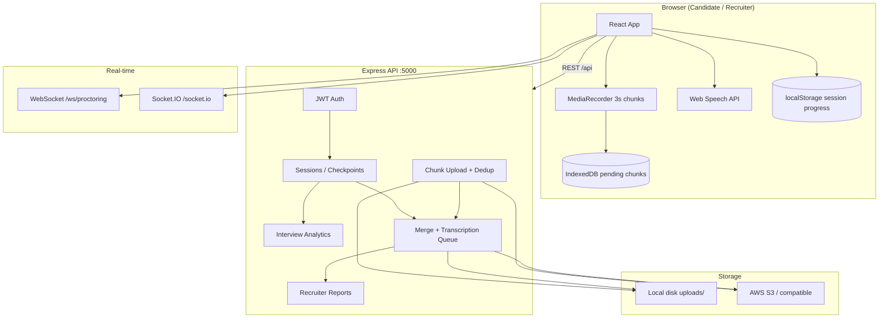
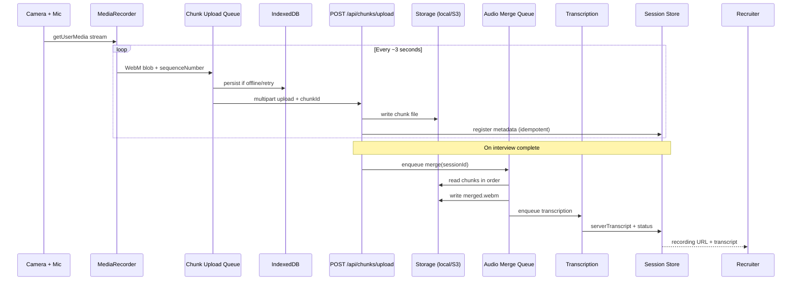
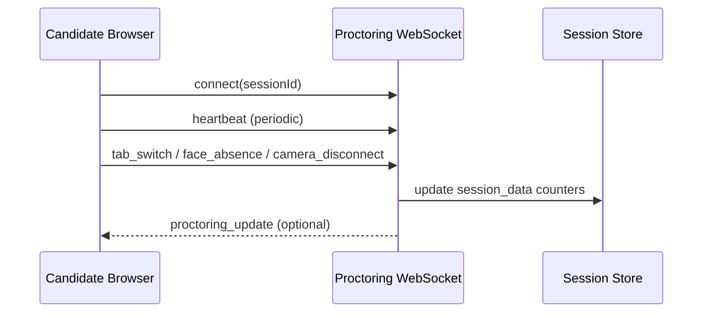
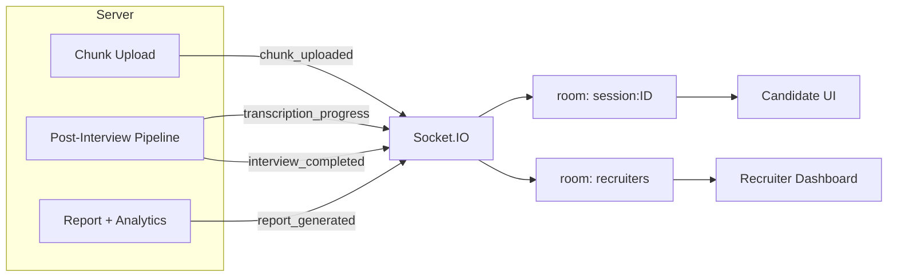

# IntervueX — AI Interview System

**IntervueX** is a full-stack, browser-based technical interview platform that combines live video capture, voice-driven Q&A, automated proctoring, chunked media upload, server-side transcription, and recruiter analytics. Candidates complete structured interviews in the browser; recruiters review recordings, transcripts, integrity signals, and AI-generated recommendations from a dedicated dashboard.

---

## Table of Contents

- [Problem Understanding](#problem-understanding)
- [Why This System Is Needed](#why-this-system-is-needed)
- [Architecture Overview](#architecture-overview)
- [Media Flow Diagram](#media-flow-diagram)
- [WebSocket & Event Flow](#websocket--event-flow)
- [Technical Decisions and Tradeoffs](#technical-decisions-and-tradeoffs)
- [Failure Scenarios and Edge Cases](#failure-scenarios-and-edge-cases)
- [Deployment](#deployment)
- [Future Improvements](#future-improvements)
- [Quick Start](#quick-start)
- [Project Structure](#project-structure)
- [License](#license)

---

## Problem Understanding

Hiring teams need to evaluate candidates remotely with more signal than a static resume or a one-way video link. Traditional approaches fall short in several ways:

| Challenge | Limitation of common tools |
|-----------|----------------------------|
| **Integrity** | No reliable visibility into tab switching, face presence, or environment |
| **Media reliability** | Long recordings fail on poor networks; uploads block completion |
| **Structured evaluation** | Unstructured calls are hard to compare across candidates |
| **Recruiter workload** | Manual note-taking and inconsistent rubrics slow decisions |
| **Auditability** | Answers, video, and flags are scattered across tools |

IntervueX addresses these by running the entire interview loop in one system: authenticated sessions, timed role-based question sets, continuous proctoring, resilient chunked recording, automated merge/transcription, scoring/analytics, and a recruiter review surface with video, transcripts, and recommendations.

---

## Why This System Is Needed

1. **Consistent interviews** — Predefined profiles (e.g. Web Dev Internship, Full-Stack Engineer) with six questions each and ~20–30 minute targets.
2. **Evidence-backed decisions** — Stored Q&A, merged recordings, optional Whisper/Deepgram transcripts, and integrity metrics.
3. **Resilience** — Chunked uploads, IndexedDB persistence, checkpoint sync, and session recovery after refresh or brief outages.
4. **Real-time visibility** — Recruiters receive live Socket.IO updates when interviews complete and reports are ready.
5. **Operational clarity** — Structured JSON logging on the server and client failure forwarding for support and debugging.

---

## Architecture Overview

IntervueX uses a **React (Vite) SPA** for the client and a **Node.js (Express) API** for business logic, with optional **MongoDB** (JSON file fallback when unset).



### Stack summary

| Layer | Technology |
|-------|------------|
| Frontend | React 19, Vite 8, Tailwind CSS 4 |
| Voice UI | Web Speech API (recognition + synthesis) |
| Recording | `MediaRecorder` (WebM, ~3s timeslice) |
| API | Express 4, Multer, JWT |
| Database | MongoDB (optional) or `server/data/sessions.json` |
| Proctoring transport | Raw WebSocket (`/ws/proctoring`) |
| Pipeline / dashboard updates | Socket.IO (`chunk_uploaded`, `transcription_progress`, `interview_completed`, `report_generated`) |
| Object storage | Local filesystem (dev) or S3-compatible (prod) |
| Transcription | Mock, OpenAI Whisper, or Deepgram |
| Merge | FFmpeg (when installed) or byte-concat fallback |

---

## Media Flow Diagram

End-to-end path from camera to recruiter playback:



### Key behaviors

- **Chunk interval:** ~3 seconds (`CHUNK_INTERVAL_MS` in `mediaRecorder.js`).
- **Minimum size:** Blobs under 256 bytes are skipped client-side; server validates similarly.
- **Identifiers:** Each chunk has a deterministic `chunkId` (`sessionId-sequence-timestamp`) for duplicate protection.
- **Sequence resume:** After refresh, recording resumes at `lastChunkIndex + 1` from session checkpoint data.
- **Playback:** Recruiters stream via `GET /api/recordings/:sessionId/video` (auth required).

---

## WebSocket & Event Flow

Two real-time channels serve different purposes:

| Channel | Path | Purpose |
|---------|------|---------|
| **Proctoring** | `ws://host/ws/proctoring?sessionId=…` | Tab switches, face absence, camera disconnect; heartbeat |
| **Pipeline / UI** | Socket.IO `/socket.io` | Chunk progress, merge/transcription status, new reports for recruiters |

### Proctoring (candidate session)



### Socket.IO (pipeline + recruiter dashboard)



| Event | Emitted when | Consumer action |
|-------|----------------|-----------------|
| `chunk_uploaded` | Chunk stored (or duplicate acknowledged) | Update upload counters |
| `transcription_progress` | Merge/transcribe stages | Show pipeline banner |
| `interview_completed` | Session marked complete, merge started | Refresh recruiter list |
| `report_generated` | Report + analytics persisted | Open review modal data |

---

## Technical Decisions and Tradeoffs

### Why chunked uploads?

| Benefit | Explanation |
|---------|-------------|
| **Network tolerance** | Small payloads retry independently with exponential backoff (1s → 2s → 4s → 8s). |
| **Progress visibility** | Recruiters and candidates see per-chunk sync status instead of a single long upload at the end. |
| **Memory bounds** | The browser never holds a 30-minute WebM blob in RAM. |
| **Failure isolation** | One bad segment does not invalidate the entire recording. |

**Tradeoff:** Merge complexity on the server (ordering, FFmpeg dependency) and slightly more storage metadata than a single file upload.

### Why streaming (incremental upload) over one full upload?

| Full upload at end | Chunked streaming (chosen) |
|--------------------|----------------------------|
| Fails entirely if connection drops near finish | Most data already on server |
| High memory use in browser | Constant small memory footprint |
| No partial recovery | IndexedDB queue + resume |
| Long blocking request | Parallel with interview progress |

**Tradeoff:** Requires idempotent chunk IDs, merge pipeline, and recruiter UI that tolerates `mergeStatus: processing`.

### Other notable choices

| Decision | Rationale | Tradeoff |
|----------|-----------|----------|
| **Web Speech API** for answers | No extra ASR cost during interview; low latency | Browser-dependent; separate from recording mic path |
| **JWT + role-based routes** | Simple auth for candidate vs recruiter | Not enterprise SSO out of the box |
| **MongoDB optional** | Fast local dev with JSON files | File store not suitable for multi-instance prod |
| **In-process merge/transcription queues** | Simple ops for demos | Replace with SQS/Lambda at scale |
| **Local + S3 storage adapter** | Same API for dev and prod | S3 upload adds latency; retried with backoff |
| **Client checkpoint + server patch** | Answers survive brief API outages | Possible short-term divergence until sync |

---

## Failure Scenarios and Edge Cases

### Network interruptions

| Phase | Behavior |
|-------|----------|
| **During interview** | `navigator.onLine` + upload queue pauses; chunks saved to IndexedDB; banner shows offline state |
| **On reconnect** | Queue drains automatically; manual **Retry uploads** resets stalled items |
| **Checkpoints** | `patchSession` failures enqueue in `checkpointSyncQueue`; flushed when API health returns |
| **API polling** | Health check every 15s; restores “server connected” messaging |

### Duplicate chunks

Duplicates are handled at multiple layers:

1. **Client** — `chunkId` set dedupes before enqueue; queue skips already-completed IDs.
2. **Server** — `findChunkByChunkId` returns success with `duplicate: true` without re-writing storage.
3. **Race** — MongoDB unique index `11000` treated as successful duplicate.
4. **Disk** — Existing chunk file skipped; metadata registered if missing.

Re-uploading the same `chunkId` is safe; sequence numbers after refresh use `lastChunkIndex + 1` to avoid overwriting different content under the same sequence file.

### Session recovery

| Trigger | Recovery mechanism |
|---------|-------------------|
| **Browser refresh** | On reload only: `localStorage` active route + `resumeSession()`; merges progress via `interviewRecovery.js` |
| **Exit and return** | `resumeFrom` on session create; checkpoint `questionIndex`, `answers`, `elapsed`, transcript |
| **API unavailable** | Local session copy + progress; sync when `patchSession` succeeds |
| **Complete while offline** | Complete may fail; local `processing_failed` state; user notified to retry |

### Camera and microphone

- Permission errors distinguish **camera blocked**, **microphone blocked**, or **both**.
- Video-only fallback is allowed for preview but warns when mic is missing for recording/voice.
- `track.onended` emits `camera_disconnect` to proctoring.

### Storage and server failures

- S3 `PutObject` retries up to 3 times; chunk remains on local disk if cloud fails.
- Chunk upload HTTP 5xx marked transient; client backoff applies.
- Merge failure sets `mergeStatus: failed`; transcription failure is non-fatal to interview completion.
- Client failures logged via `failureLogger` → `POST /api/logs/client` (structured server logs).

### Corrupted or empty chunks

- Client skips blobs &lt; 256 bytes.
- Server `chunkValidator` rejects invalid payloads with 400 and structured logs.

---

## Deployment

### Prerequisites

- **Node.js** 18+ (20+ recommended)
- **npm** 9+
- **FFmpeg** (recommended for reliable WebM merge)
- **HTTPS** in production (required for camera/microphone and speech APIs)

### Environment variables

Copy `server/.env.example` to `server/.env` and configure:

```bash
PORT=5000
JWT_SECRET=<long-random-secret>
NODE_ENV=production

# Optional — MongoDB (omit to use JSON file store; not for multi-instance prod)
MONGODB_URI=mongodb+srv://...

# Public URL for recording links
PUBLIC_API_URL=https://api.yourdomain.com

# Storage: local | s3
STORAGE_PROVIDER=s3
AWS_S3_BUCKET=your-bucket
AWS_REGION=us-east-1
AWS_ACCESS_KEY_ID=...
AWS_SECRET_ACCESS_KEY=...

# Transcription: auto | whisper | deepgram | mock
TRANSCRIPTION_PROVIDER=deepgram
DEEPGRAM_API_KEY=...
# OPENAI_API_KEY=...   # if using Whisper
```

Frontend build (optional override):

```bash
VITE_API_URL=https://api.yourdomain.com
```

### Local development

```bash
# From Ai-interview/
npm install
npm install --prefix server

# Run API + web (API on :5000, Vite on :5173 with proxy)
npm run dev:all
```

Open **http://localhost:5173**. The Vite dev server proxies `/api`, `/health`, `/ws`, and `/socket.io` to the backend.

Separate terminals:

```bash
npm run dev:server   # API only
npm run dev          # Vite only (after API is up)
```

### Production build

```bash
# Frontend static assets
npm run build
# Output: dist/

# API
cd server && npm start
```

Serve `dist/` behind nginx, Cloudflare, or S3 static hosting. Route `/api`, `/socket.io`, and `/ws` to the Node process (or API Gateway + ALB). Ensure WebSocket upgrade headers are enabled.

### Health check

```http
GET /health
```

Returns `{ ok: true, service: "intervuex-api", database: "mongodb" | "file-fallback" }`.

### Production checklist

- [ ] Set strong `JWT_SECRET` and HTTPS everywhere
- [ ] Use MongoDB for multi-instance deployments
- [ ] Set `STORAGE_PROVIDER=s3` (or R2-compatible endpoint)
- [ ] Install FFmpeg on merge workers
- [ ] Configure transcription provider keys
- [ ] Restrict CORS origins in Express if not using same-origin proxy
- [ ] Enable structured log aggregation (CloudWatch, Datadog, etc.)

---

## Future Improvements

| Area | Enhancement |
|------|-------------|
| **Scale** | Replace in-process queues with SQS + Lambda/ECS workers for merge and transcription |
| **Auth** | SSO (OIDC/SAML), magic links, org-level tenancy |
| **Interview** | Multi-language support, custom rubrics per role, human-in-the-loop question overrides |
| **Proctoring** | ML-based gaze detection, secondary camera, identity verification |
| **Analytics** | Trend dashboards, comparative cohort scoring, export to ATS |
| **Media** | Adaptive chunk size by bandwidth, WebCodecs pipeline, HLS for recruiter playback |
| **Reliability** | Background Sync API, service worker offline shell, cross-device resume |
| **Compliance** | Retention policies, GDPR delete, consent audit trail |
| **Testing** | E2E Playwright flows, load tests on chunk upload path |

---

## Quick Start

| Role | Steps |
|------|--------|
| **Candidate** | Sign in → choose interview profile → allow camera/mic → answer voice prompts → finish interview |
| **Recruiter** | Sign in → Recruiter Dashboard → **Review Interview** → video, analytics, proctoring, transcripts, approve/reject |

Demo accounts may be seeded in development (see server logs on startup). Use credentials configured in `userStore` seed data.

---

## Project Structure

```
Ai-interview/
├── src/                          # React frontend
│   ├── App.jsx                   # Routes, interview UI, recruiter dashboard
│   ├── components/               # Camera, recording, recruiter panels, failures
│   ├── hooks/                    # Camera, voice, chunks, infrastructure, realtime
│   └── lib/
│       ├── interview/            # API, chunks, recovery, profiles, reports
│       └── failure/              # Logging, user messages, checkpoint sync
├── server/
│   ├── index.js                  # Express + HTTP server
│   ├── routes/                   # auth, sessions, chunks, reports, recordings
│   ├── services/
│   │   ├── storage/              # local + S3 adapters, merge
│   │   ├── transcription/        # Whisper, Deepgram, mock
│   │   ├── analytics/            # Speaking time, scores, keywords
│   │   └── interviewPipeline.js  # Post-complete merge + transcribe
│   ├── websocket/                # Socket.IO + proctoring WS
│   └── queues/                   # Merge + transcription workers
├── ARCHITECTURE.md               # Supplementary technical notes
└── README.md                     # This document
```

---

## License

This project is provided as-is for evaluation and extension. Add your organization’s license file before public distribution.

---

**IntervueX** — structured remote interviews with integrity, resilience, and recruiter-ready evidence.
